# BoxInvert

## Description
An OpenCV computer vision tool for advanced image inversion.

## Todo
- [X] Add keyboard shorctut and pipe straight into application
- [ ] Add keyboard shortcut to docs
- [ ] Add crosshair cursor
- [ ] Fix slider labels
- [ ] Add rectangle indicator when making selections
- [ ] Add ctrl-z
- [ ] Fix middle-mouse click bug
- [ ] Change default behaviour

## Background
I use a system-wide dark gruvbox theme, and so I like all my applications to use a dark theme. This includes my note-taking application which compiles markdown using a custom stylesheet. This stylesheet is configured with gruvbox colours, and so notes look like this:

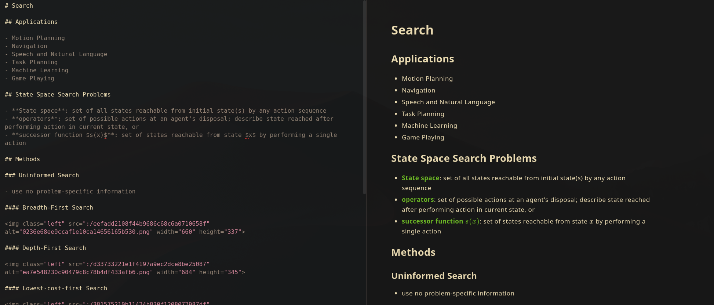

However, when I paste an image from somewhere on the internet, chances are it will have an ugly white background.

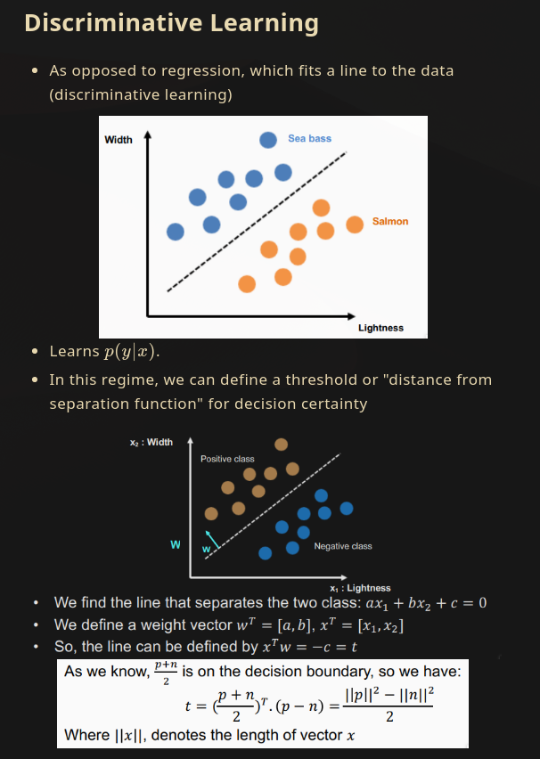

One solution is to add a css rule to invert every image, which results in this:

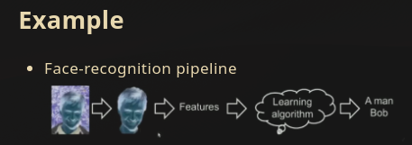

I'd like an easy way to invert only parts of an image, and that's why I created
this tool, which gives the following image,

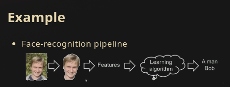

## Requirements
- NumPy
- OpenCV2

## Installation
```console
$ git clone https://github.com/deanpoulos/BoxInvert.git
$ cd BoxInvert
$ pip install .
```

## Usage

```console
$ box-invert <some_image>
```

## Example
### Step 1: Open Application

```console
$ box-invert BoxImage/img/img3.png
```
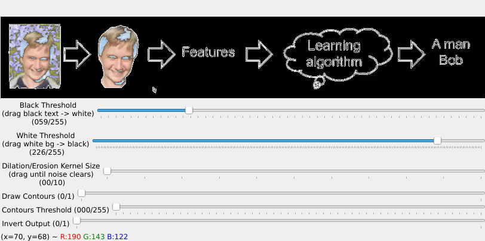

### Step 2: Adjust initial inversion thresholds.
Drag the top three sliders to adjust automatic inversion thresholding, in case of a simple
image.

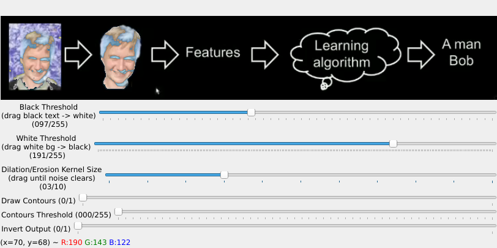

### Step 3: Invert Rectangles
Identify rectangular features to be inverted, click and drag a rectangle around
them to invert it.

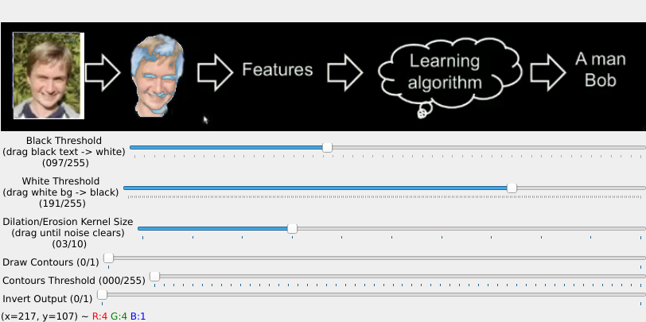

### Step 4: Un-invert Rectangles
Shift+click and drag rectangular region to un-invert selection.

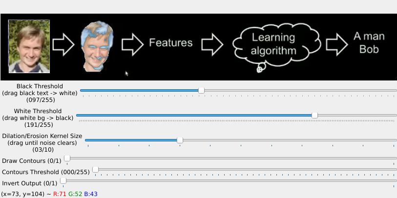

### Step 5: View Contours
For features which are not rectangular, toggle on "Draw Contours" by sliding the
slider to the end.

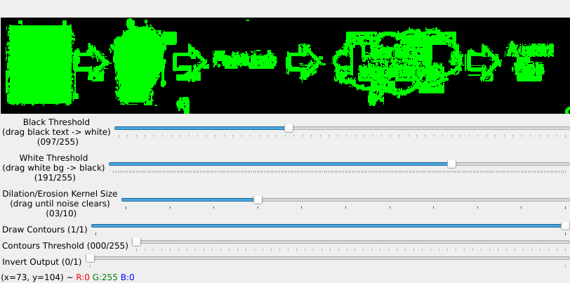

### Step 6: Refine Contours
Drag the "Contours Threshold" slider until the green selection tightly fits the
non-rectangular area you'd like to invert (in this case, it is the masked head
in the second part of the pipeline).

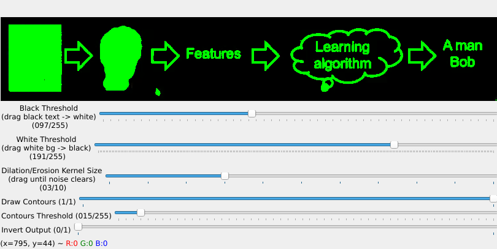

### Step 7: Invert Contoured Region
Middle-click and drag a rectangular selection around the contoured region you would
like inverted (again, it is the masked head in the second part of the pipeline).
Now, toggle-off "Draw Contours".

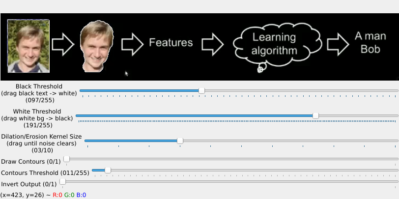

### Step 8: (optional) Invert Final Image 
If the final image is being placed in a notebook which has an image-inversion
rule in its css, you will need to invert the image in preparation. Slide the
"Invert Output" slider to the end, then right-click the image, then copy it to 
clipboard or save it.

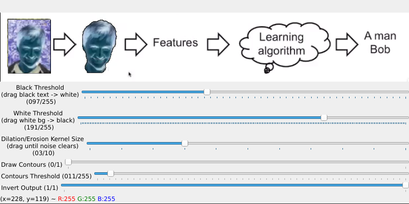
