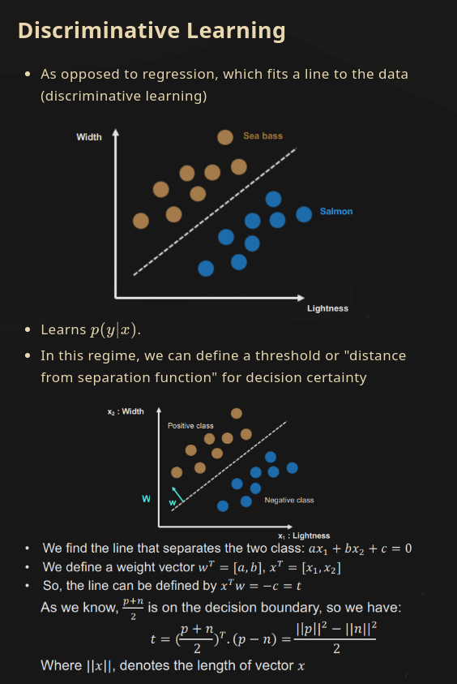

# BoxInvert

## Description
An OpenCV computer vision tool for advanced image inversion.

## Background
I use a system-wide dark gruvbox theme, and so I like all my applications to use a dark theme. This includes my note-taking application which compiles markdown using a custom stylesheet. This stylesheet is configured with gruvbox colours, and so notes look like this:

However, when I paste an image from somewhere on the internet, chances are it will have an ugly white background.

One solution is to add a css rule to invert every image, which results in this:

However, some images turn ugly...

I'd like an easy way to invert only parts of an image, e.g.,

## Usage
